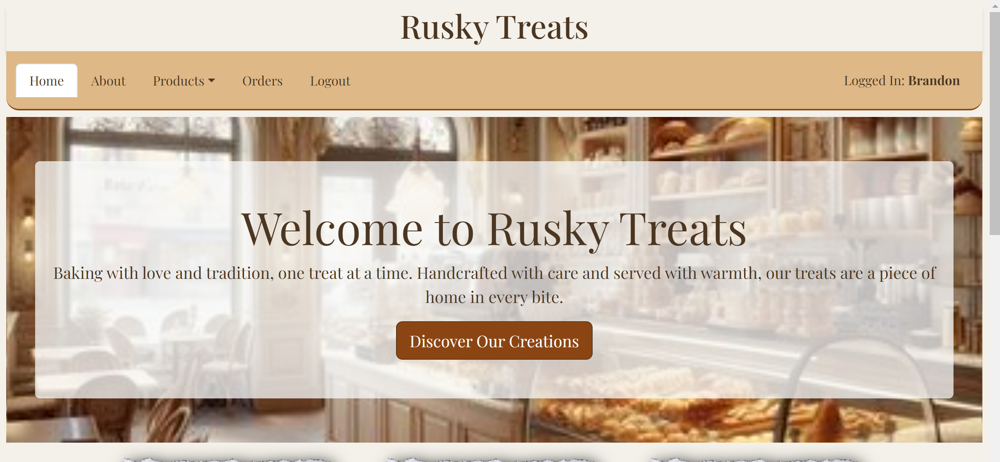
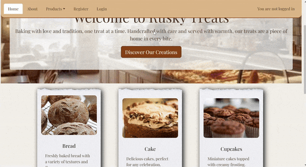
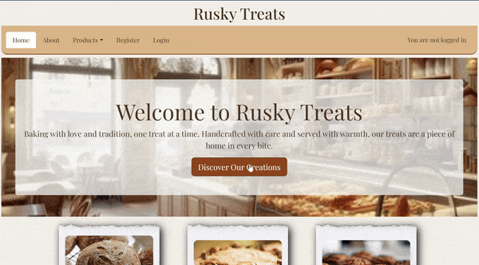
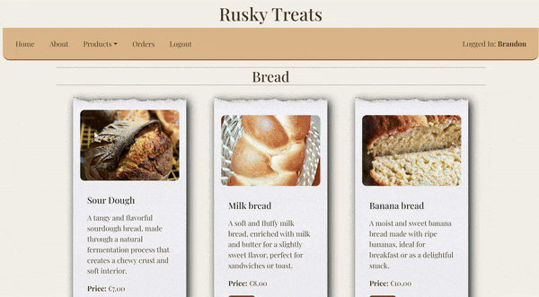

# Rusky Treat

[Click here](https://rusky-treat-ad387037dcc7.herokuapp.com/) to see deployed website!
## Table of Contents

- [About](#about)
- [Features](#features)
- [Usage](#usage)
- [Technologies used](#technologies-used)
- [Deployment](#deployment)
- [Testing and Validation](#testing-and-validation)
- [Planned Features & Future Enhancements](#planned-features-&-future-enhancements)
- [References](#references)

---
## About

Welcome to Rusky Treats, a handcrafted bakery where tradition meets taste. This website showcases a variety of baked goods, allows users to explore categories, view product details, and place orders. Built with Django, it integrates modern web technologies to deliver a seamless user experience.

---
## **Features**

1. **Homepage**
    - Hero section with a warm welcome message
    - Overview of categories and featured products

    

2. **Category Management**
    - Browse Baked goods by category (eg. Bread, Cake, Rusks)
    - superusers can add and delete categories

    

3. **Product Management**  
   - View product details, including name, description, price, and image.  
   - Superusers can add and delete products.

4. **Order Management**  
   - Add products to a cart and specify quantities.  
   - Manage orders through a dedicated orders page.

   

5. **Responsive Design**  
   - Optimized for desktops, tablets, and mobile devices.

6. **Dynamic Image Management**  
   - Images are stored on Cloudinary for efficient hosting and delivery.

7. **Admin Features**  
   - Modals for adding categories and products directly from the UI.  
   - Alerts and feedback messages for user actions (e.g., product added, category deleted).

---
## **Usage**

### Superuser
#### **Adding Products and categories**
  - Navigate to the homepage.
  - Superusers can use the "Add Category" and "Add Product" modals to manage 
    content.
  
#### **Updating Orders status**
- Navigate to the orders page
- Superuser can view all *pending* and *Processing* orders 
- if orders are *Pending* superuser can press the "sync" icon to change status 
  when starting order, this will change the status to *Processing*
- if the order is completed, superuser can press icon again to remove 
  completed order,

### User
#### **Placing Orders**
  - Browse categories or products.
  - Select quantity and click Add to Cart.
  - Review and manage orders on the orders page.

#### **Editing Cart**
- User can edit quantities and/or delete products currently in cart before 
  submitting order.

#### **Editing Order**
- If order is still *Pending*, User can:
    - Edit quantity of Product
    - Remove a product
    - Cancel Order

---
## **Technologies Used**

### Backend
- **Django**: For the web framework.  
- **PostgreSQL**: For database management.  
- **Django ORM**: To interact with the database.  
- **Cloudinary**: For storing and serving images.

### Frontend
- **HTML5, CSS, Bootstrap 5**: For styling and layout.  
- **JavaScript**: For interactivity.

### Tools
- **GitPod**: For coding environment.  
- **Crispy Forms**: For enhanced form styling.  
- **Django Messages Framework**: For user notifications.  
- **Django Summernote**: For rich-text content editing.  
- **Gunicorn**: For serving the application in production.  
- **Django Allauth**: For user authentication and management.  
- **Psycopg**: PostgreSQL database adapter for Django.  
- **WhiteNoise**: For efficient static file handling in production.

### Model Design
- [Lucidchart](https://www.lucidchart.com/pages/landing?utm_source=google&utm_medium=cpc&utm_campaign=_chart_en_tier1_mixed_search_brand_exact_&km_CPC_CampaignId=1490375427&km_CPC_AdGroupID=137488435595&km_CPC_Keyword=lucid%20app&km_CPC_MatchType=e&km_CPC_ExtensionID=&km_CPC_Network=g&km_CPC_AdPosition=&km_CPC_Creative=598116882677&km_CPC_TargetID=kwd-302739930476&km_CPC_Country=1007878&km_CPC_Device=c&km_CPC_placement=&km_CPC_target=&gad_source=1&gclid=Cj0KCQiAu8W6BhC-ARIsACEQoDC-BzS7dziSMLoEBtF0Z2DOJXTpL7FyFaclwr3qG5UtSK2dCjWHiu8aAplXEALw_wcB)

  - My Schema Model Design in LucidChart [**view here**](./static/images/model-schema.png) 
  
- [Balsamic](https://balsamiq.com/)
  - [index Page](./static/images/balsamiq-index.png) 
  - [About Page](./static/images/balsamiq-about.png) 
  - [Product Page](./static/images/balsamiq-product-page.png) 
  - [Product Detail page](./static/images/balsamic-product-detail-page.png) 
  - [Order Page](./static/images/balsamiq-order-page.png) 
  - [Admin Order Page](./static/images/balsamic-admin-order-page.png) 

---
## Deployment
This website has been deloyed using Heruko.
The link to the website is at the start of the Readme.

### Local Development
### Prerequisites
- Python 3.10+  
- Django 4.2+  
- PostgreSQL  
- Cloudinary account  

#### How to Fork

To fork the repository:

1. Log in (or sign up) to Github.
2. Go to the repository for this project, brandonn3lson/Rusky-Treat.
3. Click the Fork button in the top right corner.

#### How to Clone
1. Find the repository for this project, Rusky-Treat
2. **Get the Clone URL** Click on the green "Code" button and copy the URL that appears.
3. Open Terminal or Command Prompt: Open the Terminal (Mac/Linux) or Command Prompt (Windows).
4. Navigate to the Directory: Use the cd command to go to the folder where you want to put the cloned repository.
5. Clone the Repository: Type git clone, paste the URL you copied, and press Enter.
6. Wait for it to Finish: It might take a moment. Once it's done, you'll see a message.
7. Done!: You now have a copy of the repository on your computer.

---
## **Testing and Validation**

### Validators used

- W3C validator
- Waves
- lighthouse
- jigsaw css validator
- CI python Linter

  ### W3C validator

  - [Index Page HTML](./static/images/w3c-index.png)
  - [Product Page HTML](./static/images/w3c-product-page.png)
  - [Product Detail HTML](./static/images/w3c-product-detail-page.png)
  - [Order Page HTML](./static/images/w3c-order-page.png)
  - [Admin Order Page HTML](./static/images/w3c-admin-order-page.png)
  - [About Page HTML](./static/images/w3c-about-page.png)
  - [login Page HTML](./static/images/w3c-login-page.png)
  - [logout Page HTML](./static/images/w3c-logout-page.png)
  - [404 HTML](./static/images/w3c-404-page.png)

  ### Waves accessiblity validator
  - [Index Page HTML](./static/images/waze-index.png)
  - [Product Page HTML](./static/images/waze-product-page.png)
  - [Product Detail HTML](./static/images/waze-product-detail-page.png)
  - [About Page HTML](./static/images/waze-about-page.png)
  - [login Page HTML](./static/images/waze-login-page.png)
  - [registry Page HTML](./static/images/waze-registry-page.png)

  ### LightHouse Analysis
  *Mobile*
    - [Index Page HTML](./static/images/lighthouse-mobile-index.png)
    - [Product Page HTML](./static/images/lighthouse-mobile-product-page.png)
    - [Product Detail HTML](./static/images/lighthouse-mobile-product-detail-page.png)
    - [Order Page HTML](./static/images/lighthouse-mobile-order-page.png)
    - [Admin Order Page HTML](./static/images/lighthouse-mobile-admin-order-page.png)
    - [About Page HTML](./static/images/lighthouse-mobile-about.png)
    - [login Page HTML](./static/images/lighthouse-mobile-login.png)
    - [logout Page HTML](./static/images/lighthouse-mobile-logout.png)
    - [registry Page HTML](./static/images/lighthouse-mobile-registry.png)
  
  *Desktop*
    - [Index Page HTML](./static/images/lighthouse-desktop-index.png)
    - [Product Page HTML](./static/images/lighthouse-desktop-product-page.png)
    - [Product Detail HTML](./static/images/lighthouse-desktop-product-detail-page.png)
    - [Order Page HTML](./static/images/lighthouse-desktop-order-page.png)
    - [Admin Order Page HTML](./static/images/lighthouse-desktop-admin-order-page.png)
    - [About Page HTML](./static/images/lighthouse-desktop-about.png)
    - [login Page HTML](./static/images/lighthouse-desktop-login.png)
    - [logout Page HTML](./static/images/lighthouse-desktop-logout.png)
    - [registry Page HTML](./static/images/lighthouse-desktop-registry.png)

  ### jigsaw css validator

  - [css validator image](./static/images/jigsaw-css-validate.png)

  ### CI python Linter
    - all python files were put throught the Linter and came back PEP8 compatible
    - [python validator image](./static/images/python-pep8-validator.png)

### Manual Testing

| **Test Case**                    | **Test Steps**                                                                                                                                       | **Expected Result**                                                                                                                                                             | **Status** | **Notes**                                      |
|-----------------------------------|-----------------------------------------------------------------------------------------------------------------------------------------------------|--------------------------------------------------------------------------------------------------------------------------------------------------------------------------------|------------|------------------------------------------------|
| **Homepage Load**                 | 1. Navigate to the homepage of Rusky Treats.                                                                                                         | The homepage should load successfully with the hero section, navigation bar, and all relevant content.                                                                         | Pass       | Verify that all elements are visible and styled.|
| **Category Browsing**             | 1. Click on a product category in the navbar or dropdown.                                                                                           | The user should be directed to the category page with the appropriate products displayed.                                                                                         | Pass       | Check that correct products appear in each category.|
| **Product Page Navigation**       | 1. Select a product from the homepage or category page.                                                                                             | The product details page should load with the product's image, description, and price.                                                                                          | Pass       | Confirm all product details are displayed.      |
| **Add Product to Cart**           | 1. Navigate to a product details page. 2. Select a quantity and click "Add to Cart."                                                             | The product should be added to the cart with the selected quantity, and a confirmation message should appear.                                                                   | Pass       | Ensure the cart is updated correctly.           |
| **Login to Order**                | 1. Log in as a user. 2. Navigate to a product details page. 3. Attempt to add a product to the cart.                                          | The user should be able to add the product to the cart after logging in.                                                                                                      | Pass       | Check that login redirects to product page.     |
| **Add Product Form (Admin)**      | 1. Log in as a superuser. 2. Navigate to the "Add Product" modal. 3. Fill out the form and submit.                                             | The new product should be added to the database and appear on the products page.                                                                                                | Pass       | Ensure validation checks are in place.          |
| **Delete Product (Admin)**        | 1. Log in as a superuser. 2. Navigate to a product page. 3. Click the delete button for a product.                                              | The selected product should be removed from the database and no longer appear on the product page.                                                                              | Pass       | Ensure correct product removal from database.   |
| **Display Toast Notifications**   | 1. Perform an action that triggers a toast notification (e.g., adding to cart, logging in, etc.).                                                     | A toast notification should appear in the bottom right of the screen indicating success or failure (depending on the action).                                                   | Pass       | Confirm the notification message and style.     |
| **User Logout**                   | 1. Log in as a user. 2. Navigate to the "Logout" button and click it.                                                                             | The user should be logged out, and the page should redirect to the homepage with login and registration options available.                                                       | Pass       | Ensure logout successfully clears session.      |
| **Admin Category Addition**       | 1. Log in as a superuser. 2. Navigate to the "Add Category" modal. 3. Fill out the form and submit.                                              | The new category should be added to the category list, and the products page should reflect this new category.                                                                  | Pass       | Check the correct creation of categories.       |
| **Responsive Design**             | 1. Resize the browser window or test on different devices (mobile, tablet, desktop).                                                                  | The layout should adjust appropriately for each screen size, with mobile views collapsing into dropdown menus and smaller sections, and the desktop view displaying more content. | Pass       | Test across different screen sizes.             |
| **Product Image Display**         | 1. Navigate to a product details page. 2. Check that the product image loads properly.                                                           | The product image should display at full resolution and should be responsive to window resizing.                                                                               | Pass       | Verify image resolution and responsiveness.     |
| **Form Validation (Add Category)**| 1. Log in as a superuser. 2. Open the "Add Category" form. 3. Submit the form with missing or incorrect data (e.g., blank fields).             | The form should display an error message for missing or incorrect fields.                                                                                                     | Pass       | Ensure field validation works correctly.        |
| **Error Page Handling**           | 1. Navigate to a non-existing page.                                                                                           | A 404 error page should appear with a message indicating that the page was not found.                                                                                           | Pass       | Test with random invalid URLs.                 |
| **Product Detail Redirection**    | 1. Click on a product's "View" button from the category or homepage.                                                                                  | The page should redirect to the correct product details page for the selected product.                                                                                         | Pass       | Verify the redirection works as expected.       |

---
 ## Planned Features & Future Enhancements
 - **User Confirmation Step**: 
    - An additional confirmation step is triggered when the button is clicked, requiring the user to confirm their decision."
- **Email/sms notification**
    - Notify user when order is being processed/completed
- **User Profile Page**
    - Add a profile page for users to edit and display there detail, favourite product, allergies, profile 
      image etc..
- **Comment/rating of products**
    - user can leave comments and rating on the products

## References
- [Code Institute](https://codeinstitute.com/)
- [Stack Overflow](https://stackoverflow.com/)
  - [request.FILES](https://stackoverflow.com/questions/3111779/how-can-i-get-the-file-name-from-request-files)
  - [Implement pot save logic](https://stackoverflow.com/questions/47019474/implementing-a-post-save-logic-by-overriding-save-related-in-django-admin)

- [Django Documentation](https://www.djangoproject.com/)
  - [Pagination](https://docs.djangoproject.com/en/5.1/topics/pagination/)
  - [Creating forms for Models](https://docs.djangoproject.com/en/5.1/topics/forms/modelforms/)
  - [Request.FILES](https://docs.djangoproject.com/en/5.1/topics/http/file-uploads/)
  - [Build in Template Tags & Filters](https://docs.djangoproject.com/en/4.2/ref/templates/builtins/#ref-templates-builtins-filters)

- [Dev.To](https://dev.to/)
  - [Context processors](https://dev.to/sarahhudaib/context-processors-in-django-15h2)

-[W3schools](https://www.w3schools.com/html/)
  - [attribute enctype](https://django-crispy-forms.readthedocs.io/en/latest/) was used on form to upload image file for new categories and products.

- [Crispy Forms Documentation](https://django-crispy-forms.readthedocs.io/en/latest/)